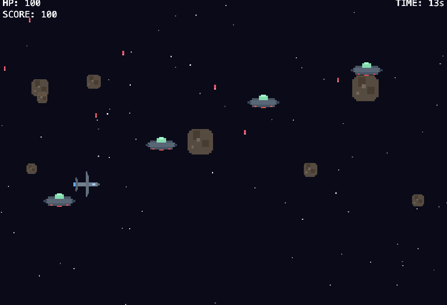

# Bye Bye Alien 👾🛩️

A 2D space-shooter built with **Phaser 3**, **TypeScript**, **Vite** and **Vitest**.



Pick one of **four ships** on the start screen, then battle waves of
Independence-Day-style alien saucers, dodge asteroid obstacles, grab a
**UFO-disguise power-up** that maxes out all stats for 10 seconds, and survive
long enough to face the **Mothership** boss that appears after 30 seconds.

All graphics are procedurally generated pixel art — no external image assets required.

---

## Quick Start

```bash
npm install
npm run dev        # starts Vite dev server on http://localhost:3000
```

## Controls

### Start screen (ship selection)

| Key | Action |
|-----|--------|
| **← / A** | Previous ship |
| **→ / D** | Next ship |
| **ENTER / Space** | Launch game |
| **Click** | Select & launch |

### In-game

| Key | Action |
|-----|--------|
| **W / ↑** | Move up |
| **A / ←** | Move left |
| **S / ↓** | Move down |
| **D / →** | Move right |
| **Space** | Fire (also auto-fires) |
| **R** | Restart with same ship (after game over) |
| **Q** | Return to ship selection (after game over) |

## Scripts

| Command | Description |
|---------|-------------|
| `npm run dev` | Start dev server with HMR |
| `npm run build` | Type-check + production build |
| `npm run preview` | Preview the production build locally |
| `npm test` | Run unit tests (Vitest) |
| `npm run test:watch` | Run tests in watch mode |

## Project Structure

```
src/
├── main.ts                 # Phaser game bootstrap
├── config/
│   ├── game.ts             # Game-wide constants
│   ├── game.test.ts        # Tests for game constants
│   ├── ships.ts            # ShipStats interface, 4 ships, POWERUP_STATS
│   └── ships.test.ts       # Tests for ship definitions
├── entities/
│   ├── Player.ts           # Player ship class
│   ├── Player.test.ts      # Unit tests (Phaser mocked)
│   ├── Alien.ts            # Alien enemy class
│   ├── Alien.test.ts       # Unit tests (Phaser mocked)
│   ├── Boss.ts             # Mothership boss class
│   └── Boss.test.ts        # Unit tests (Phaser mocked)
├── scenes/
│   ├── StartScene.ts       # Ship-selection start screen
│   └── GameScene.ts        # Main gameplay scene
└── utils/
    ├── textures.ts         # Procedural pixel-art texture generator
    └── textures.test.ts    # Tests for texture generation
```

## Ships

| Ship | Style | Speed | HP | Damage | Fire Rate |
|------|-------|-------|----|--------|-----------|
| **F-35 Lightning** | Balanced all-rounder | 300 | 100 | 10 | 5 /s |
| **Valkyrie** | Fast interceptor, fragile | 420 | 60 | 6 | 9 /s |
| **Titan** | Heavy gunship, slow but devastating | 180 | 200 | 22 | 2.5 /s |
| **Spectre** | Stealth striker, precise long-range | 260 | 80 | 18 | 3.5 /s |

## Power-up

At 20 seconds a **UFO-disguise pickup** drifts across the screen. Grab it to
temporarily transform into a UFO with maxed-out stats (speed 450, damage 30,
fire rate 10 /s, HP 250) for 10 seconds. A HUD bar shows the remaining time.

## Mothership Boss

The **Mothership** appears at 30 seconds (with a 5-second warning).
It slides in from the right and patrols vertically. It fires **aimed
bullets** at the player. Below 50 % HP it switches to a **3-way spread**
pattern. Defeating it scores 2 000 points and wins the game.

## Adding New Ships

1. Add the key to `SHIP_KEYS` and a new entry to `SHIPS` in `src/config/ships.ts`:

```ts
export const SHIP_KEYS = ['f35', 'valkyrie', 'titan', 'spectre', 'raptor'] as const;

export const SHIPS: Record<ShipKey, ShipStats> = {
  // ...existing ships...
  raptor: {
    name: 'F-22 Raptor',
    description: 'Air-superiority fighter. Fast and agile.',
    textureKey: 'raptor',
    bulletTextureKey: 'bullet_raptor',
    speed: 350,
    handling: 1.2,
    damage: 8,
    hp: 80,
    fireRate: 7,
    bulletSpeed: 550,
  },
};
```

2. Add `generateRaptor(scene)` and `generateBulletRaptor(scene)` functions in
   `src/utils/textures.ts`, and call them from `generateTextures()`.

## License

ISC
